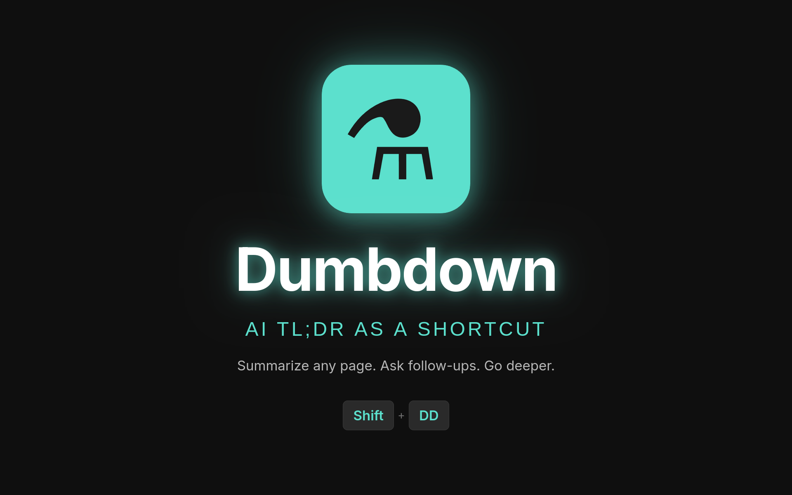

A browser extension that summarizes any webpage with your favorite LLM. Hold Shift and type DD, or click the toolbar icon, and Dumbdown opens your selected LLM with the page ready to summarize. No API keys needed—it uses the LLM's web interface directly.

**Supported LLMs:** Perplexity, ChatGPT, Claude

## Build

```bash
npm install
npm run build          # Build for all browsers
npm run build:chrome   # Build for Chrome only
npm run build:firefox  # Build for Firefox only
```

## Package

```bash
npm run package        # Package for all browsers
npm run package:chrome # Package for Chrome only
npm run package:firefox # Package for Firefox only
```
